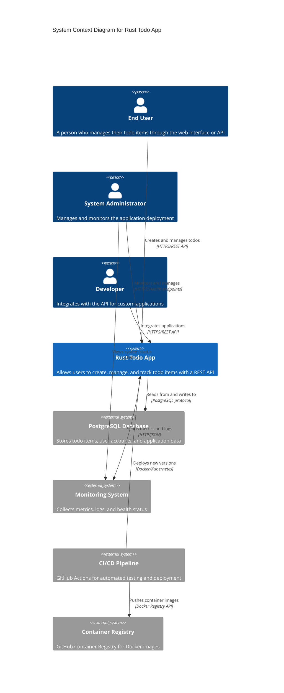

# Level 1: System Context Diagram

## Overview

The System Context diagram shows the Rust Todo App and how it fits into the world around it - who uses it and what other systems it interacts with.

## System Context

## Actors

### End User
- **Role**: Primary application user
- **Goals**: Manage personal todo items efficiently
- **Interactions**: 
  - Create, read, update, delete todo items
  - User registration and authentication
  - Access via web interface or direct API calls

### System Administrator  
- **Role**: Operations and maintenance
- **Goals**: Ensure system availability and performance
- **Interactions**:
  - Monitor application health and metrics
  - Deploy and configure application instances
  - Manage database and infrastructure

### Developer
- **Role**: Third-party integrator
- **Goals**: Build applications using the todo API
- **Interactions**:
  - Consume REST API endpoints
  - Access OpenAPI documentation
  - Implement authentication flows

## External Systems

### PostgreSQL Database
- **Purpose**: Primary data persistence layer
- **Technology**: PostgreSQL 12+
- **Data**: User accounts, todo items, application metadata
- **Connection**: Async connection pool via SQLx

### Monitoring System
- **Purpose**: Observability and alerting
- **Technology**: Prometheus/Grafana compatible
- **Data**: Application metrics, health status, performance data
- **Connection**: HTTP metrics endpoints

### CI/CD Pipeline
- **Purpose**: Automated testing and deployment
- **Technology**: GitHub Actions
- **Responsibilities**:
  - Run automated tests and security scans
  - Build and publish Docker images
  - Deploy to target environments

### Container Registry
- **Purpose**: Store and distribute application images
- **Technology**: GitHub Container Registry (ghcr.io)
- **Content**: Multi-platform Docker images
- **Access**: Public read, authenticated write

## Key Interactions

1. **User Management Flow**
   - User registers → App validates → Database stores
   - User authenticates → App verifies → JWT token issued

2. **Todo Operations Flow**
   - User requests → App processes → Database persists
   - App returns → User receives confirmation

3. **Deployment Flow**
   - Code push → CI/CD triggers → Tests run → Image built → Registry stores → Deployment updates

4. **Monitoring Flow**
   - App generates metrics → Monitoring collects → Admin views dashboards

## Business Context

- **Domain**: Personal productivity and task management
- **Scale**: Individual users with personal todo lists
- **Availability**: High availability for web-based access
- **Performance**: Sub-100ms API response times
- **Security**: User data protection and secure authentication
