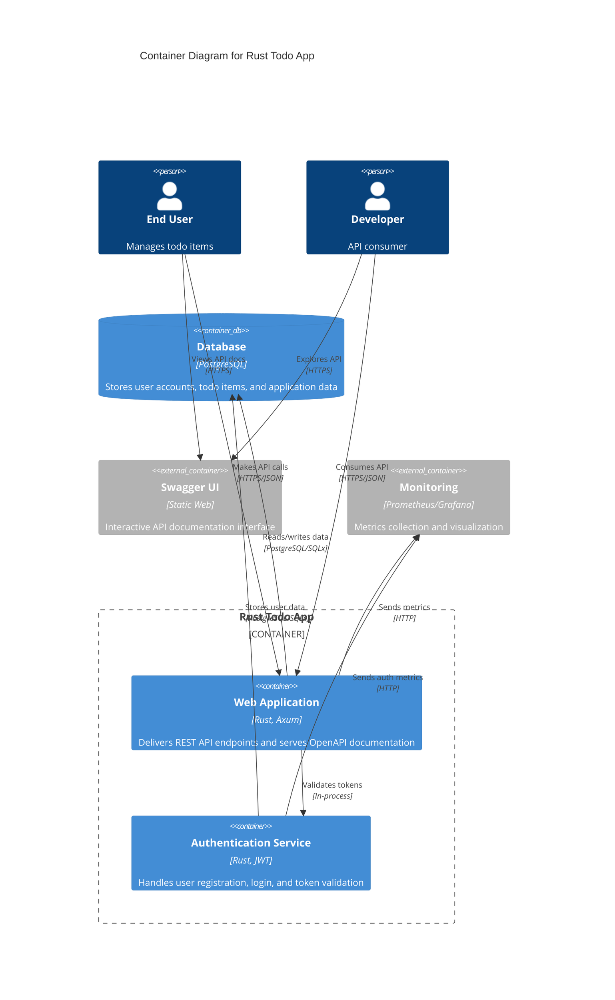

# Level 2: Container Diagram

## Overview

The Container diagram shows the high-level technology choices and how responsibilities are distributed across containers within the Rust Todo App system.

## Container Architecture



## Containers

### Web Application
- **Technology**: Rust + Axum web framework
- **Responsibilities**:
  - HTTP request routing and handling
  - Todo CRUD operations
  - Health check endpoints
  - OpenAPI specification serving
  - Request/response serialization
- **Port**: 8000 (configurable)
- **Dependencies**: Authentication Service, Database

### Authentication Service  
- **Technology**: Rust + JWT + Argon2
- **Responsibilities**:
  - User registration and validation
  - Password hashing and verification
  - JWT token generation and validation
  - Session management
- **Integration**: Embedded within main application
- **Dependencies**: Database

### Database
- **Technology**: PostgreSQL 12+
- **Responsibilities**:
  - Persistent data storage
  - ACID transaction support
  - User account management
  - Todo item storage
- **Connection**: Async connection pool (SQLx)
- **Port**: 5432

### Swagger UI (External)
- **Technology**: Static web interface
- **Responsibilities**:
  - Interactive API documentation
  - API endpoint testing
  - Schema visualization
- **Integration**: Embedded in web application
- **Path**: `/swagger-ui`

### Monitoring (External)
- **Technology**: Prometheus-compatible metrics
- **Responsibilities**:
  - Application performance monitoring
  - Health status tracking
  - Error rate monitoring
- **Endpoints**: `/health`, `/metrics`

## Technology Stack

### Runtime Environment
- **Language**: Rust 1.70+
- **Runtime**: Tokio async runtime
- **Framework**: Axum web framework
- **Serialization**: Serde (JSON)

### Data Layer
- **Database**: PostgreSQL with SQLx
- **Connection**: Async connection pooling
- **Migrations**: SQLx migrations
- **ORM**: Type-safe SQL with compile-time verification

### Security
- **Authentication**: JWT tokens
- **Password Hashing**: Argon2
- **HTTPS**: TLS termination at load balancer
- **Input Validation**: Serde deserialization

### Documentation
- **API Spec**: OpenAPI 3.0 (utoipa)
- **Interactive Docs**: Swagger UI
- **Code Docs**: Rustdoc

## Container Communication

### Internal Communication
- **Web App ↔ Auth Service**: In-process function calls
- **Services ↔ Database**: Async PostgreSQL connections
- **Components**: Shared Rust structs and traits

### External Communication
- **Client ↔ Web App**: HTTPS REST API (JSON)
- **App ↔ Monitoring**: HTTP metrics endpoints
- **CI/CD ↔ App**: Docker container deployment

## Deployment Model

### Single Container Deployment
```
┌─────────────────────────────┐
│     Docker Container        │
│  ┌─────────────────────────┐│
│  │    Rust Todo App        ││
│  │  ┌─────────┬─────────┐  ││
│  │  │Web App  │Auth Svc │  ││
│  │  └─────────┴─────────┘  ││
│  └─────────────────────────┘│
└─────────────────────────────┘
```

### Multi-Container Development
```
┌──────────────┐  ┌──────────────┐
│ App Container│  │ DB Container │
│              │  │              │
│ Rust Todo App│◄─┤ PostgreSQL   │
│              │  │              │
└──────────────┘  └──────────────┘
```

## Scalability Considerations

- **Horizontal Scaling**: Stateless application containers
- **Database Scaling**: Connection pooling and read replicas
- **Load Balancing**: Multiple application instances
- **Caching**: In-memory caching for frequently accessed data
