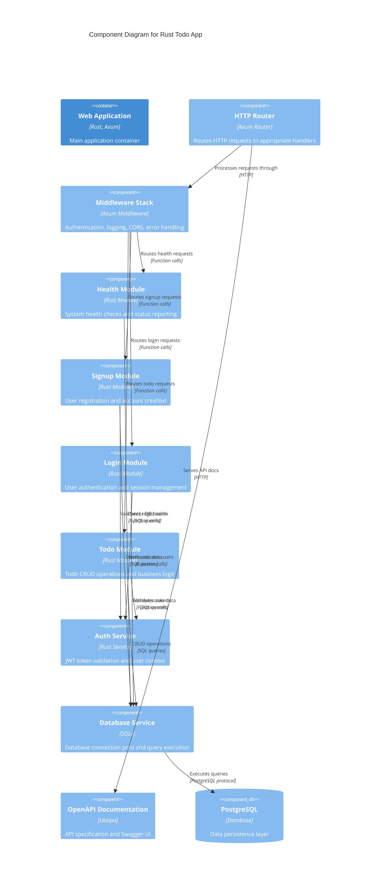

# Level 3: Component Diagram

## Overview

The Component diagram shows the internal structure of the Rust Todo App container, breaking down the application into its key components and their relationships.

## Component Architecture



## Core Components

### HTTP Router
- **Technology**: Axum Router
- **Responsibilities**:
  - Route matching and dispatch
  - Path parameter extraction
  - Method-based routing
- **Endpoints**:
  - `/health` → Health Module
  - `/signup` → Signup Module  
  - `/login` → Login Module
  - `/todos` → Todo Module
  - `/swagger-ui` → OpenAPI Documentation

### Middleware Stack
- **Technology**: Axum middleware layers
- **Components**:
  - **CORS Middleware**: Cross-origin request handling
  - **Auth Middleware**: JWT token validation
  - **Logging Middleware**: Request/response logging
  - **Error Middleware**: Centralized error handling
- **Processing Order**: CORS → Logging → Auth → Error → Route Handler

### Business Logic Modules

#### Health Module
- **Location**: `src/modules/health/`
- **Responsibilities**:
  - Application health status
  - Database connectivity checks
  - System resource monitoring
- **Endpoints**: `GET /health`
- **Dependencies**: Database Service

#### Signup Module  
- **Location**: `src/modules/signup/`
- **Responsibilities**:
  - User registration validation
  - Password strength requirements
  - Account creation workflow
- **Endpoints**: `POST /signup`
- **Dependencies**: Auth Service, Database Service

#### Login Module
- **Location**: `src/modules/login/`
- **Responsibilities**:
  - User authentication
  - Password verification
  - JWT token generation
- **Endpoints**: `POST /login`
- **Dependencies**: Auth Service, Database Service

#### Todo Module
- **Location**: `src/modules/todo/` (planned)
- **Responsibilities**:
  - Todo item CRUD operations
  - User-specific todo filtering
  - Todo status management
- **Endpoints**: 
  - `GET /todos` - List todos
  - `POST /todos` - Create todo
  - `PUT /todos/{id}` - Update todo
  - `DELETE /todos/{id}` - Delete todo
- **Dependencies**: Auth Service, Database Service

## Service Components

### Auth Service
- **Location**: `src/auth.rs`
- **Responsibilities**:
  - JWT token generation and validation
  - Password hashing (Argon2)
  - User context extraction
  - Session management
- **Key Functions**:
  - `hash_password()` - Secure password hashing
  - `verify_password()` - Password verification
  - `generate_token()` - JWT creation
  - `validate_token()` - JWT verification

### Database Service
- **Technology**: SQLx with PostgreSQL
- **Responsibilities**:
  - Connection pool management
  - Query execution and result mapping
  - Transaction management
  - Database health monitoring
- **Features**:
  - Compile-time SQL verification
  - Async query execution
  - Type-safe result mapping
  - Connection pooling

### OpenAPI Documentation
- **Technology**: Utoipa + Swagger UI
- **Responsibilities**:
  - API specification generation
  - Interactive documentation serving
  - Schema validation
- **Integration**: Compile-time API doc generation

## Data Flow Patterns

### Request Processing Flow
```
HTTP Request → Router → Middleware Stack → Module Handler → Service Layer → Database
```

### Authentication Flow
```
Request → Auth Middleware → JWT Validation → User Context → Handler
```

### Error Handling Flow
```
Error → Error Middleware → Structured Response → HTTP Client
```

## Module Structure

Each business module follows a consistent structure:

```
src/modules/{module_name}/
├── mod.rs           # Module exports and configuration
├── routes.rs        # HTTP route handlers
├── service.rs       # Business logic implementation
└── interfaces/      # Data structures and DTOs
    ├── mod.rs
    ├── requests.rs  # Request DTOs
    └── responses.rs # Response DTOs
```

## Component Dependencies

### Dependency Graph
```
Router
├── Middleware Stack
│   ├── Health Module → Database Service
│   ├── Signup Module → Auth Service, Database Service
│   ├── Login Module → Auth Service, Database Service
│   └── Todo Module → Auth Service, Database Service
├── Auth Service → Database Service
└── OpenAPI Documentation
```

### Shared Dependencies
- **Serde**: JSON serialization across all modules
- **Tokio**: Async runtime for all components
- **Tracing**: Logging infrastructure
- **SQLx**: Database access layer

## Error Handling Strategy

- **Module Level**: Business logic validation errors
- **Service Level**: Database and external service errors  
- **Middleware Level**: Authentication and authorization errors
- **Router Level**: HTTP protocol and routing errors

Each level transforms errors into appropriate HTTP responses with structured error messages.
