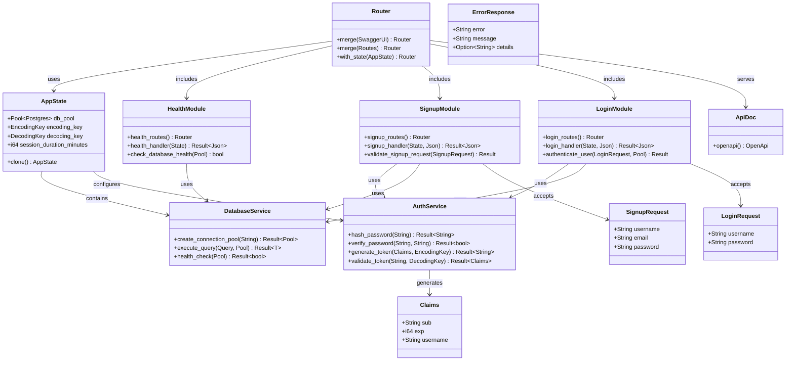

# Level 4: Code Diagram

## Overview

The Code diagram shows the implementation structure within the Rust Todo App, focusing on the key classes, interfaces, and their relationships at the code level.

## Code Structure



## Core Implementation Files

### Main Application (`src/main.rs`)

```rust
// Key structures and initialization
pub struct AppState {
    pub db_pool: Pool<Postgres>,
    pub encoding_key: EncodingKey,
    pub decoding_key: DecodingKey,
    pub session_duration_minutes: i64,
}

#[tokio::main]
async fn main() -> Result<(), Box<dyn std::error::Error>>
```

**Responsibilities**:
- Application bootstrap and configuration
- Database connection pool setup
- JWT key initialization
- Router composition and server startup

### Authentication Service (`src/auth.rs`)

```rust
// Core authentication functions
pub fn hash_password(password: &str) -> Result<String, argon2::Error>
pub fn verify_password(password: &str, hash: &str) -> Result<bool, argon2::Error>
pub fn generate_token(claims: &Claims, key: &EncodingKey) -> Result<String, jsonwebtoken::errors::Error>
pub fn validate_token(token: &str, key: &DecodingKey) -> Result<Claims, jsonwebtoken::errors::Error>

#[derive(Debug, Serialize, Deserialize)]
pub struct Claims {
    pub sub: String,
    pub exp: i64,
    pub username: String,
}
```

**Responsibilities**:
- Password hashing and verification using Argon2
- JWT token generation and validation
- User claims management
- Security utilities

### Module Structure Pattern

Each module follows this implementation pattern:

#### Module Definition (`mod.rs`)
```rust
pub mod routes;
pub mod service;
pub mod interfaces;

pub use routes::*;
```

#### Route Handlers (`routes.rs`)
```rust
pub fn module_routes() -> Router<AppState> {
    Router::new()
        .route("/endpoint", post(handler_function))
}

async fn handler_function(
    State(app_state): State<AppState>,
    Json(request): Json<RequestDto>
) -> Result<Json<ResponseDto>, ErrorResponse>
```

#### Business Logic (`service.rs`)
```rust
pub async fn business_operation(
    request: RequestDto,
    pool: &Pool<Postgres>
) -> Result<ResponseDto, ServiceError>
```

#### Data Transfer Objects (`interfaces/`)
```rust
#[derive(Serialize, Deserialize, ToSchema)]
pub struct RequestDto {
    pub field: String,
}

#[derive(Serialize, Deserialize, ToSchema)]
pub struct ResponseDto {
    pub result: String,
}
```

## Key Design Patterns

### State Management Pattern
- **AppState**: Shared application state using Axum's state extraction
- **Dependency Injection**: Services injected via state
- **Resource Pooling**: Database connections managed centrally

### Error Handling Pattern
```rust
// Centralized error types
#[derive(Debug)]
pub enum ServiceError {
    DatabaseError(sqlx::Error),
    ValidationError(String),
    AuthenticationError(String),
}

// Error conversion and HTTP response mapping
impl IntoResponse for ServiceError {
    fn into_response(self) -> Response {
        // Convert to appropriate HTTP status and JSON error
    }
}
```

### Async/Await Pattern
- All I/O operations use async/await
- Database queries return `Future<Result<T, Error>>`
- HTTP handlers are async functions
- Connection pooling with async connections

### Type Safety Pattern
```rust
// Compile-time SQL verification
sqlx::query_as!(
    User,
    "SELECT id, username, email FROM users WHERE id = $1",
    user_id
)

// Serde serialization with type safety
#[derive(Serialize, Deserialize, sqlx::FromRow)]
pub struct User {
    pub id: i32,
    pub username: String,
    pub email: String,
}
```

## Database Layer Implementation

### Connection Management
```rust
// Connection pool configuration
let pool = PgPoolOptions::new()
    .max_connections(5)
    .connect(&database_url)
    .await?;
```

### Query Patterns
```rust
// Type-safe queries with compile-time verification
async fn get_user_by_id(id: i32, pool: &Pool<Postgres>) -> Result<User, sqlx::Error> {
    sqlx::query_as!(
        User,
        "SELECT id, username, email FROM users WHERE id = $1",
        id
    )
    .fetch_one(pool)
    .await
}
```

## OpenAPI Integration

### Documentation Generation
```rust
#[derive(OpenApi)]
#[openapi(
    paths(health_handler, signup_handler, login_handler),
    components(schemas(SignupRequest, LoginRequest, ErrorResponse))
)]
pub struct ApiDoc;
```

### Schema Definitions
```rust
#[derive(Serialize, Deserialize, ToSchema)]
pub struct SignupRequest {
    #[schema(example = "john_doe")]
    pub username: String,
    
    #[schema(example = "john@example.com")]
    pub email: String,
    
    #[schema(example = "secure_password123")]
    pub password: String,
}
```

## Testing Structure

### Unit Tests
```rust
#[cfg(test)]
mod tests {
    use super::*;
    
    #[tokio::test]
    async fn test_password_hashing() {
        let password = "test_password";
        let hash = hash_password(password).unwrap();
        assert!(verify_password(password, &hash).unwrap());
    }
}
```

### Integration Tests
```rust
#[tokio::test]
async fn test_signup_endpoint() {
    let app = create_test_app().await;
    let response = app
        .oneshot(
            Request::builder()
                .method(http::Method::POST)
                .uri("/signup")
                .header(http::header::CONTENT_TYPE, mime::APPLICATION_JSON.as_ref())
                .body(Body::from(signup_json))
                .unwrap(),
        )
        .await
        .unwrap();
    
    assert_eq!(response.status(), StatusCode::CREATED);
}
```

## Performance Considerations

- **Zero-Copy Deserialization**: Serde with efficient JSON parsing
- **Connection Pooling**: Reused database connections
- **Async I/O**: Non-blocking operations throughout
- **Compile-Time Optimizations**: Rust's zero-cost abstractions
- **Memory Safety**: No garbage collection overhead
