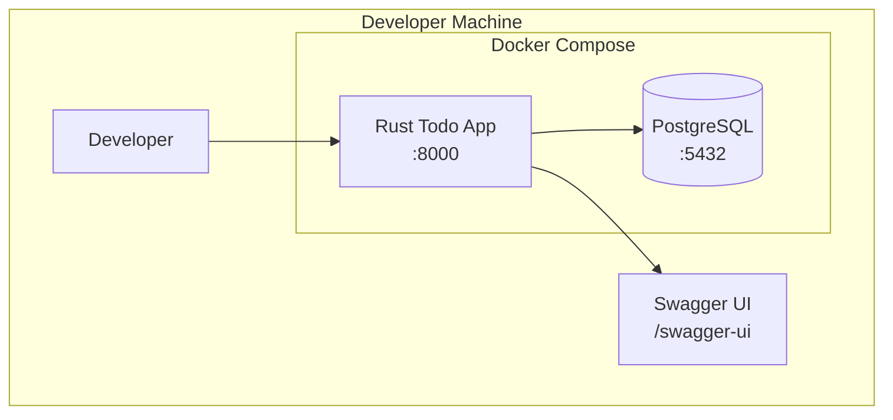
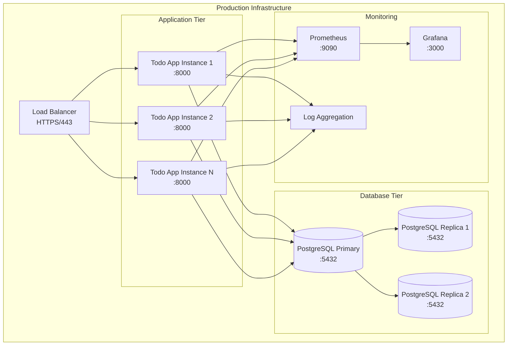

# Deployment Architecture

## Overview

This document describes the deployment architecture for the Rust Todo App, covering containerization, orchestration, and infrastructure patterns.

## Deployment Models

### Development Environment



**Configuration**: `docker-compose.yml`
- Single-node deployment
- Local development database
- Hot reload capabilities
- Debug logging enabled

### Production Environment



## Container Strategy

### Docker Image Structure

```dockerfile
# Multi-stage build for optimized production image
FROM rust:1.70 as builder
WORKDIR /app
COPY . .
RUN cargo build --release

FROM debian:bookworm-slim
RUN apt-get update && apt-get install -y ca-certificates
COPY --from=builder /app/target/release/rust_todo_app /usr/local/bin/
EXPOSE 8000
CMD ["rust_todo_app"]
```

**Image Characteristics**:
- **Base Image**: Debian slim for minimal attack surface
- **Size**: ~50MB optimized production image
- **Security**: Non-root user, minimal dependencies
- **Multi-arch**: AMD64 and ARM64 support

### Container Registry

**GitHub Container Registry (ghcr.io)**:
```bash
# Image tags
ghcr.io/gaspecian/rust_todo_app:latest      # Latest stable
ghcr.io/gaspecian/rust_todo_app:v1.0.0      # Specific version
ghcr.io/gaspecian/rust_todo_app:main        # Development branch
```

## Orchestration Platforms

### Docker Compose (Development)

```yaml
version: '3.8'
services:
  app:
    image: ghcr.io/gaspecian/rust_todo_app:latest
    ports:
      - "8000:8000"
    environment:
      - DATABASE_URL=postgresql://postgres:password@db:5432/todo_app
      - RUST_LOG=debug
    depends_on:
      - db
    
  db:
    image: postgres:15
    environment:
      - POSTGRES_DB=todo_app
      - POSTGRES_PASSWORD=password
    volumes:
      - postgres_data:/var/lib/postgresql/data
    ports:
      - "5432:5432"

volumes:
  postgres_data:
```

### Kubernetes (Production)

#### Deployment Manifest
```yaml
apiVersion: apps/v1
kind: Deployment
metadata:
  name: rust-todo-app
spec:
  replicas: 3
  selector:
    matchLabels:
      app: rust-todo-app
  template:
    metadata:
      labels:
        app: rust-todo-app
    spec:
      containers:
      - name: app
        image: ghcr.io/gaspecian/rust_todo_app:latest
        ports:
        - containerPort: 8000
        env:
        - name: DATABASE_URL
          valueFrom:
            secretKeyRef:
              name: db-secret
              key: url
        resources:
          requests:
            memory: "64Mi"
            cpu: "50m"
          limits:
            memory: "128Mi"
            cpu: "200m"
        livenessProbe:
          httpGet:
            path: /health
            port: 8000
          initialDelaySeconds: 30
          periodSeconds: 10
        readinessProbe:
          httpGet:
            path: /health
            port: 8000
          initialDelaySeconds: 5
          periodSeconds: 5
```

#### Service Configuration
```yaml
apiVersion: v1
kind: Service
metadata:
  name: rust-todo-app-service
spec:
  selector:
    app: rust-todo-app
  ports:
  - protocol: TCP
    port: 80
    targetPort: 8000
  type: ClusterIP
```

## Infrastructure as Code

### Terraform Configuration

```hcl
# AWS ECS Deployment
resource "aws_ecs_cluster" "todo_app" {
  name = "rust-todo-app"
}

resource "aws_ecs_task_definition" "todo_app" {
  family                   = "rust-todo-app"
  network_mode             = "awsvpc"
  requires_compatibilities = ["FARGATE"]
  cpu                      = 256
  memory                   = 512
  
  container_definitions = jsonencode([
    {
      name  = "rust-todo-app"
      image = "ghcr.io/gaspecian/rust_todo_app:latest"
      
      portMappings = [
        {
          containerPort = 8000
          hostPort      = 8000
        }
      ]
      
      environment = [
        {
          name  = "DATABASE_URL"
          value = var.database_url
        }
      ]
      
      healthCheck = {
        command = ["CMD-SHELL", "curl -f http://localhost:8000/health || exit 1"]
        interval = 30
        timeout = 5
        retries = 3
      }
    }
  ])
}
```

## CI/CD Pipeline

### GitHub Actions Workflow

```yaml
name: Deploy
on:
  push:
    branches: [main]
    tags: ['v*']

jobs:
  build-and-deploy:
    runs-on: ubuntu-latest
    steps:
    - uses: actions/checkout@v4
    
    - name: Build Docker image
      run: docker build -t ghcr.io/gaspecian/rust_todo_app:${{ github.sha }} .
    
    - name: Push to registry
      run: |
        echo ${{ secrets.GITHUB_TOKEN }} | docker login ghcr.io -u ${{ github.actor }} --password-stdin
        docker push ghcr.io/gaspecian/rust_todo_app:${{ github.sha }}
    
    - name: Deploy to production
      run: |
        kubectl set image deployment/rust-todo-app app=ghcr.io/gaspecian/rust_todo_app:${{ github.sha }}
        kubectl rollout status deployment/rust-todo-app
```

## Environment Configuration

### Environment Variables

| Variable | Development | Production | Description |
|----------|-------------|------------|-------------|
| `DATABASE_URL` | `postgresql://localhost/todo_app` | `postgresql://prod-db:5432/todo_app` | Database connection |
| `RUST_LOG` | `debug` | `info` | Logging level |
| `PORT` | `8000` | `8000` | Server port |
| `HOST` | `127.0.0.1` | `0.0.0.0` | Bind address |
| `JWT_SECRET` | `dev_secret` | `${VAULT_JWT_SECRET}` | JWT signing key |

### Configuration Management

**Development**: `.env` files and docker-compose
**Production**: Kubernetes secrets and ConfigMaps

```yaml
apiVersion: v1
kind: Secret
metadata:
  name: app-secrets
type: Opaque
data:
  jwt-secret: <base64-encoded-secret>
  database-url: <base64-encoded-url>
```

## Monitoring and Observability

### Health Checks

**Application Health Endpoint**: `GET /health`
```json
{
  "status": "healthy",
  "database": "connected",
  "timestamp": "2024-08-31T14:24:27Z"
}
```

**Container Health Check**:
```dockerfile
HEALTHCHECK --interval=30s --timeout=3s --start-period=5s --retries=3 \
  CMD curl -f http://localhost:8000/health || exit 1
```

### Metrics Collection

**Prometheus Metrics**: `/metrics` endpoint
- HTTP request duration
- Database connection pool status
- Active user sessions
- Error rates by endpoint

### Logging Strategy

**Structured Logging**:
```rust
tracing::info!(
    user_id = %user.id,
    endpoint = "/todos",
    duration_ms = %duration.as_millis(),
    "Request completed successfully"
);
```

**Log Aggregation**: 
- Development: Console output
- Production: Centralized logging (ELK stack, CloudWatch)

## Security Considerations

### Network Security
- **TLS Termination**: At load balancer level
- **Internal Communication**: Service mesh or VPC
- **Database Access**: Private subnets only

### Container Security
- **Non-root User**: Application runs as non-privileged user
- **Read-only Filesystem**: Immutable container filesystem
- **Security Scanning**: Automated vulnerability scanning in CI/CD

### Secrets Management
- **Development**: Local `.env` files (not committed)
- **Production**: Kubernetes secrets or cloud secret managers
- **Rotation**: Automated secret rotation policies

## Scaling Strategies

### Horizontal Scaling
- **Stateless Design**: No server-side session storage
- **Load Balancing**: Round-robin or least-connections
- **Auto-scaling**: Based on CPU/memory metrics

### Database Scaling
- **Connection Pooling**: Configurable pool size
- **Read Replicas**: For read-heavy workloads
- **Sharding**: For large-scale deployments

### Performance Optimization
- **Resource Limits**: CPU and memory constraints
- **JIT Compilation**: Rust's zero-cost abstractions
- **Connection Reuse**: HTTP keep-alive and database pooling
